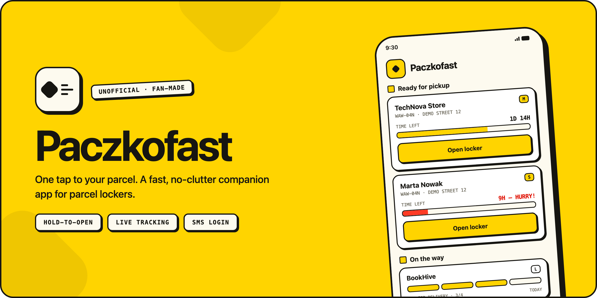
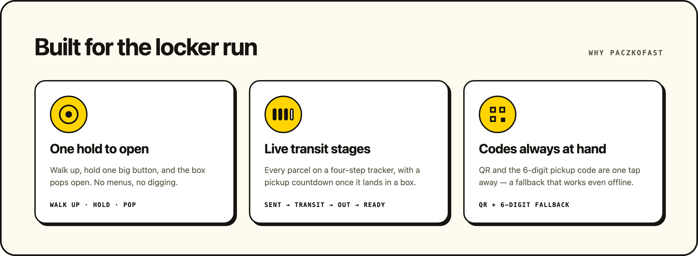
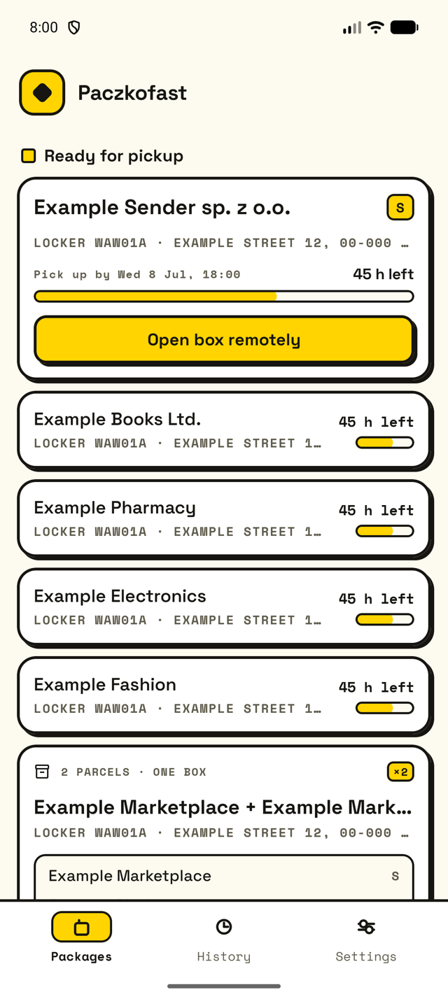
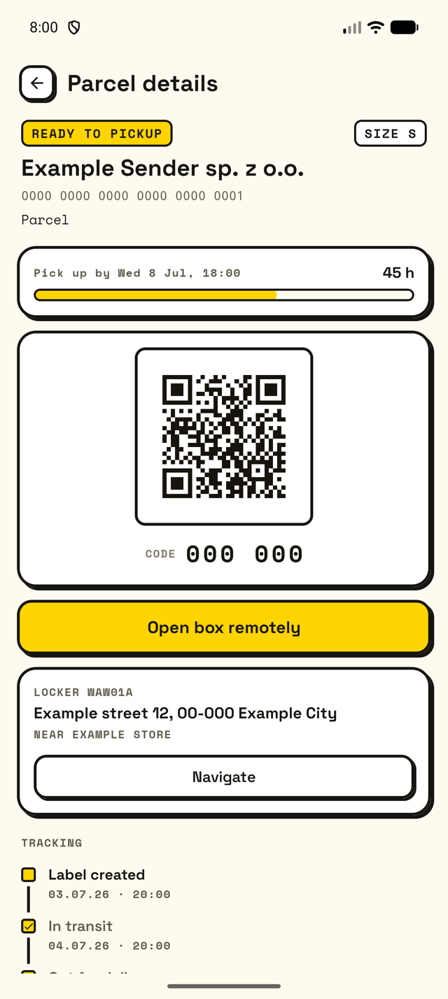
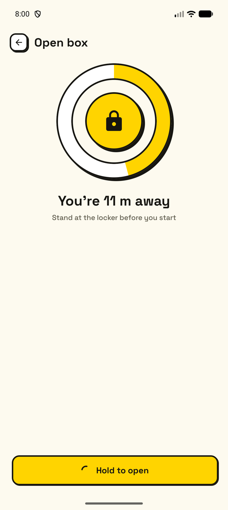
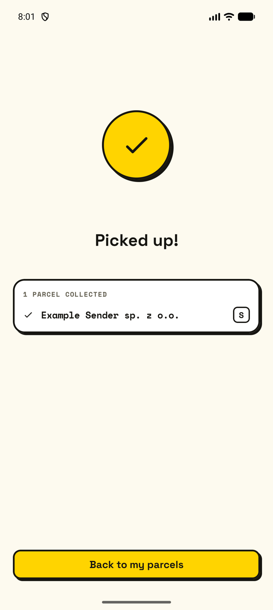
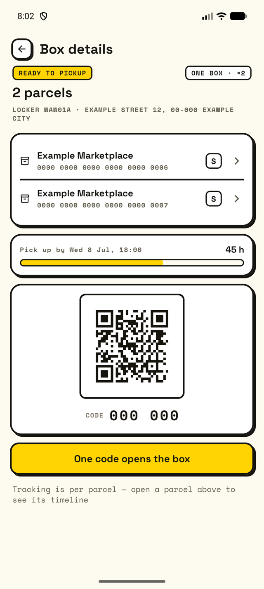
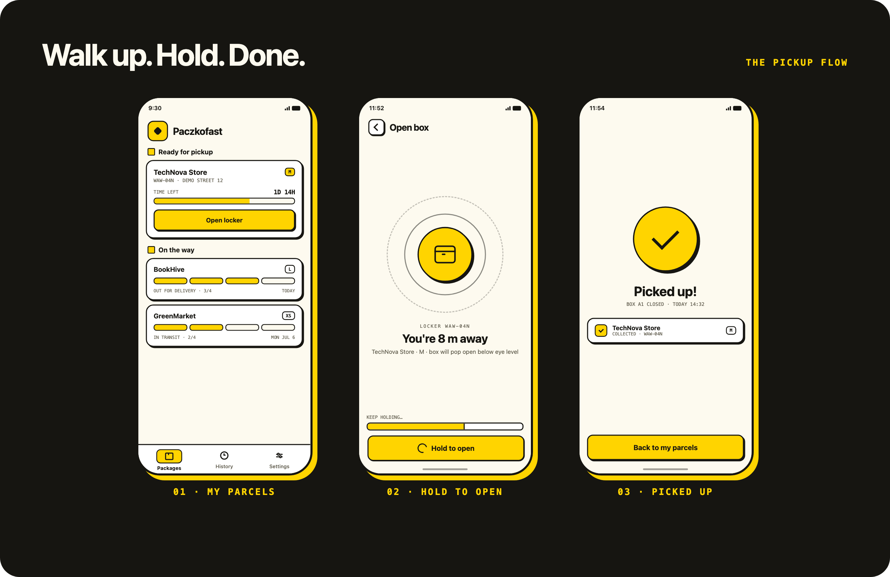

<p align="center">
  
</p>

# Paczkofast

Paczkofast is a small native Android app for checking tracked parcels and
opening a pickup locker with as little friction as possible.

The idea is simple: when you are standing next to the locker, the parcel you
need should already be at the top, the pickup code should be visible, and the
remote-open action should be one deliberate gesture away.

## Why

No extra features, no slow splash screens, no confusing navigation.
Just easy and fast parcel pickup.

## Disclaimer

Paczkofast is an unofficial, experimental companion app. It is not affiliated
with, endorsed by, or supported by InPost or any locker operator. The API used by
this project is not public/stable and may change without notice.

The implementation is based on observed app behavior and community API notes,
including:

https://github.com/tajchert/inpost-api-docs

Do not use this project in a way that violates service terms, local law, or user
privacy.

## Features

<p align="center">
  
</p>

- SMS login flow.
- Tracked parcel list.
- Ready-for-pickup and in-transit sections.
- Pickup history tab.
- Parcel detail screen with locker, deadline, QR/code, and tracking timeline.
- Multi-package box detail for parcels sharing one compartment.
- Remote collect flow:
  - validate parcel and location
  - open compartment
  - wait for opened status
  - wait for closed status
  - confirm closed
  - claim collected parcels
- Settings screen with theme mode and logout.
- Offline-first parcel cache using Room.
- Native Jetpack Compose UI with accessibility semantics.

This app intentionally omits some areas, such as loyalty programs. That choice
keeps the app focused on one simple, fast core use case instead of spreading
attention across 100 features. Keeping things simple is the art.

## Screens

Captured from the offline demo build (mock data only). Track a parcel, hold to
open the locker, done.

<p align="center">
  
  
  
  
  
</p>

## Tech Stack

This app was built with AI agents (Claude and Codex) and a modern stack:

- Kotlin 2.4
- Android Gradle Plugin 9
- Jetpack Compose
- Material 3
- AndroidX Navigation 3
- Hilt
- Retrofit 3
- OkHttp 5
- kotlinx.serialization
- Room
- Preferences DataStore
- Kotlin coroutines and Flow
- ZXing for QR rendering
- JUnit and coroutine test utilities

## Architecture

The project is split into app, core, and feature modules.

```text
app
core:model
core:common
core:designsystem
core:ui
core:database
core:datastore
core:network
core:data
core:domain
core:testing
feature:auth:api
feature:auth:impl
feature:parcels:api
feature:parcels:impl
feature:settings:api
feature:settings:impl
```

Key decisions:

- **Native Android, not WebView**: pickup flows need fast startup, direct system
  integration, native location permission handling, and reliable TalkBack
  behavior.
- **Compose-first UI**: screens are small, state-driven, previewable, and easy to
  iterate on.
- **Feature API/impl split**: route keys live in `feature:*:api`; screens and
  ViewModels live in `feature:*:impl`.
- **Offline-first reads**: parcel screens observe Room. Network refreshes update
  the cache instead of owning UI state directly.
- **Use cases for business flows**: multi-step operations such as locker opening
  live in `core:domain`.
- **DTOs stay out of UI**: network models map through data/domain layers before
  reaching features.
- **Navigation 3 route keys**: navigation uses typed `NavKey` routes instead of
  string route templates.

## Why It Is Fast

<p align="center">
  
</p>

Paczkofast is fast because the app path is intentionally narrow.

- The first screen after login is the parcel list, not a dashboard.
- Ready parcels are prioritized above in-transit parcels.
- The first ready parcel is expanded.
- Multi-package parcels sharing a compartment are collapsed into one box entry.
- Detail screens read cached Room data immediately.
- Pull-to-refresh does not clear existing content.
- Remote opening is a single hold gesture, reducing accidental taps while keeping
  the action quick.
- The network layer uses short timeouts so slow connections fail into visible
  UI states instead of hanging indefinitely.

## Contributing

Feel free to open a PR. Please first cross-check your proposal with an AI agent
so we avoid a ping-pong of comments. This saves time for both of us.

## Build

Use the Gradle wrapper:

```bash
./gradlew :app:compileDebugKotlin
./gradlew :app:assembleDebug
./gradlew test
```

Useful targeted checks:

```bash
./gradlew :core:domain:test
./gradlew :core:data:testDebugUnitTest
./gradlew :core:network:testDebugUnitTest
./gradlew :feature:parcels:impl:testDebugUnitTest
./gradlew lint
```

The project targets Java 17.

## Repository Guide

For a deeper developer guide, read:

[AGENTS.md](AGENTS.md)

That file documents module boundaries, key files, screen states, error handling,
privacy rules, commands, and implementation details for contributors.

## Privacy

This app deals with sensitive parcel data. Keep the public repository clean:

- Do not commit real parcel numbers.
- Do not commit pickup codes or QR payloads.
- Do not commit real phone numbers.
- Do not commit real names, sender names, locker IDs, or addresses.
- Do not commit screenshots from a real account.
- Do not enable body-level network logging in committed code.

Use obviously fake data in tests, previews, docs, and design exports.

## Status

Paczkofast is experimental. Expect API changes, incomplete edge-case handling,
and implementation details that may evolve quickly.

Contributions should keep the core promise intact: fast parcel lookup, clear
pickup state, and a deliberate remote-open flow.
